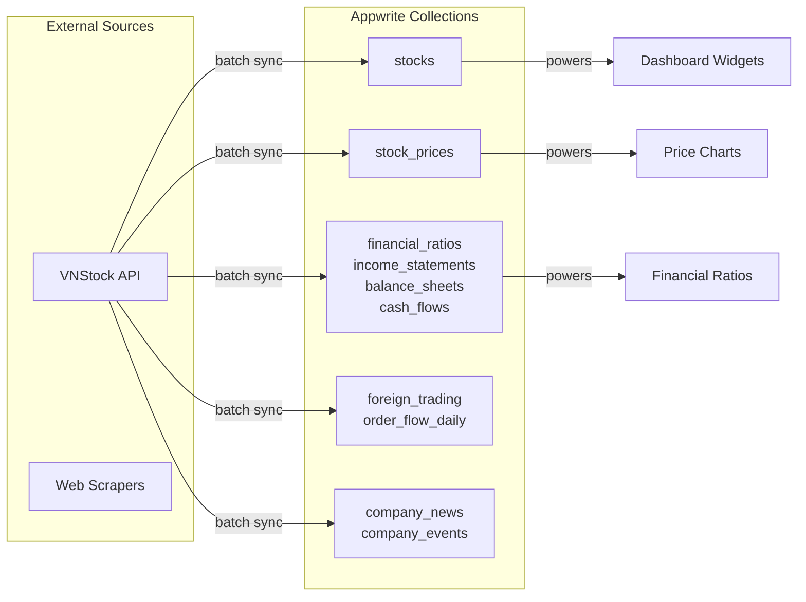

# Appwrite Database Schema

**Endpoint:** https://sgp.cloud.appwrite.io/v1  
**Database ID:** 69a9c70d0026c7d08f51  
**Total Collections:** 26

---

## Entity Relationship Diagram (Mermaid)

```mermaid
erDiagram
    stocks ||--o{ stock_prices : "symbol"
    stocks ||--o{ intraday_trades : "symbol"
    stocks ||--o{ balance_sheets : "symbol"
    stocks ||--o{ cash_flows : "symbol"
    stocks ||--o{ financial_ratios : "symbol"
    stocks ||--o{ income_statements : "symbol"
    stocks ||--o{ dividends : "symbol"
    stocks ||--o{ company_events : "symbol"
    stocks ||--o{ company_news : "symbol"
    stocks ||--o{ insider_deals : "symbol"
    stocks ||--o{ foreign_trading : "symbol"
    stocks ||--o{ order_flow_daily : "symbol"
    stocks ||--o{ orderbook_snapshots : "symbol"
    stocks ||--o{ screener_snapshots : "symbol"
    
    companies ||--o{ shareholders : "symbol"
    companies ||--o{ officers : "symbol"
    companies ||--o{ subsidiaries : "symbol"
    
    stock_indices ||--o{ screener_snapshots : "index_code"
    
    user_dashboards ||--o{ dashboard_widgets : "dashboard_id"
    
    companies {
        string symbol PK "Stock ticker (VNM, VCI...)"
        string company_name "Full company name"
        string short_name "Short name"
        string exchange "HOSE, HNX, UPCOM"
        string industry "Industry classification"
        string sector "Sector"
    }
    
    stocks {
        string symbol PK "Stock ticker"
        string company_name "Company name"
        string exchange "HOSE, HNX, UPCOM"
        string industry "Industry"
        string sector "Sector"
        bool is_active "Active status"
    }
    
    stock_prices {
        string symbol FK "Stock ticker"
        datetime time "Price timestamp"
        string interval "1D, 1H, 15m..."
        float open "Opening price"
        float high "High price"
        float low "Low price"
        float close "Closing price"
        float volume "Trading volume"
    }
    
    income_statements {
        string symbol FK "Stock ticker"
        string period "2024Q1, FY2024..."
        string period_type "QUARTER, YEAR"
        float revenue "Total revenue"
        float gross_profit "Gross profit"
        float net_income "Net income"
        float eps "Earnings per share"
    }
    
    balance_sheets {
        string symbol FK "Stock ticker"
        string period "Period label"
        float total_assets "Total assets"
        float total_liabilities "Total liabilities"
        float total_equity "Total equity"
    }
    
    financial_ratios {
        string symbol FK "Stock ticker"
        string period "Period label"
        float pe_ratio "P/E ratio"
        float pb_ratio "P/B ratio"
        float roe "Return on equity"
        float roa "Return on assets"
    }
    
    foreign_trading {
        string symbol FK "Stock ticker"
        datetime trade_date "Trade date"
        float buy_value "Buy value"
        float sell_value "Sell value"
        float net_value "Net value"
    }
```



---

## Collections Detail

### 1. Stocks (`stocks`)
Master stock list with basic info.

| Attribute | Type | Description |
|----------|------|-------------|
| `symbol` | string | Stock ticker (VNM, VCI, ...) |
| `isin` | string | ISIN code |
| `company_name` | string | Full company name |
| `short_name` | string | Short name |
| `exchange` | string | HOSE, HNX, UPCOM |
| `industry` | string | Industry |
| `sector` | string | Sector |
| `is_active` | bool | Active status |
| `listing_date` | datetime | Listing date |
| `symbol_q` | string | Query attribute (uppercase) |
| `exchange_q` | string | Exchange query |
| `industry_q` | string | Industry query |
| `sector_q` | string | Sector query |

**Indexes:** symbol_q, exchange_q, industry_q

---

### 2. Stock Prices (`stock_prices`)
Historical OHLCV price data.

| Attribute | Type | Description |
|----------|------|-------------|
| `symbol` | string | Stock ticker |
| `time` | datetime | Price timestamp |
| `open` | float | Opening price |
| `high` | float | High price |
| `low` | float | Low price |
| `close` | float | Closing price |
| `volume` | float | Volume |
| `value` | float | Trade value |
| `adj_close` | float | Adjusted close |
| `interval` | string | 1D, 1H, 15m... |
| `symbol_q` | string | Query attribute |
| `time_dt` | datetime | Datetime for queries |
| `interval_q` | string | Interval query |

**Indexes:** symbol_q, time_dt, symbol_q+time_dt+interval_q

---

### 3. Intraday Trades (`intraday_trades`)
Tick-level trade data.

| Attribute | Type | Description |
|----------|------|-------------|
| `symbol` | string | Stock ticker |
| `trade_time` | datetime | Trade timestamp |
| `price` | float | Trade price |
| `volume` | float | Trade volume |
| `match_type` | string | Match type |
| `accumulated_vol` | float | Accumulated volume |
| `accumulated_val` | float | Accumulated value |
| `transaction_id` | string | Transaction ID |

**Indexes:** symbol_q, trade_time_dt, symbol_q+trade_time_dt

---

### 4. Income Statements (`income_statements`)
Income statement data (quarterly/annual).

| Attribute | Type | Description |
|----------|------|-------------|
| `symbol` | string | Stock ticker |
| `period` | string | 2024Q1, FY2024 |
| `period_type` | string | QUARTER, YEAR |
| `fiscal_year` | int | Fiscal year |
| `fiscal_quarter` | int | Fiscal quarter (1-4) |
| `revenue` | float | Total revenue |
| `cost_of_revenue` | float | Cost of revenue |
| `gross_profit` | float | Gross profit |
| `operating_expenses` | float | Operating expenses |
| `operating_income` | float | Operating income |
| `net_income` | float | Net income |
| `eps` | float | Earnings per share |
| `ebitda` | float | EBITDA |

**Indexes:** symbol_q, symbol_q+period_type+fiscal_year+fiscal_quarter

---

### 5. Balance Sheets (`balance_sheets`)
Balance sheet data.

| Attribute | Type | Description |
|----------|------|-------------|
| `symbol` | string | Stock ticker |
| `period` | string | Period label |
| `period_type` | string | QUARTER, YEAR |
| `total_assets` | float | Total assets |
| `current_assets` | float | Current assets |
| `cash_and_equivalents` | float | Cash |
| `total_liabilities` | float | Total liabilities |
| `current_liabilities` | float | Current liabilities |
| `total_equity` | float | Total equity |
| `book_value_per_share` | float | BVPS |

**Indexes:** symbol_q, symbol_q+period_type+fiscal_year+fiscal_quarter

---

### 6. Cash Flows (`cash_flows`)
Cash flow statement data.

| Attribute | Type | Description |
|----------|------|-------------|
| `symbol` | string | Stock ticker |
| `period` | string | Period label |
| `operating_cash_flow` | float | Operating cash flow |
| `free_cash_flow` | float | Free cash flow |
| `dividends_paid` | float | Dividends paid |
| `net_change_in_cash` | float | Net change in cash |

**Indexes:** symbol_q, symbol_q+period_type+fiscal_year+fiscal_quarter

---

### 7. Financial Ratios (`financial_ratios`)
Pre-calculated financial ratios.

| Attribute | Type | Description |
|----------|------|-------------|
| `symbol` | string | Stock ticker |
| `period` | string | Period label |
| `pe_ratio` | float | P/E ratio |
| `pb_ratio` | float | P/B ratio |
| `ps_ratio` | float | P/S ratio |
| `peg_ratio` | float | PEG ratio |
| `ev_ebitda` | float | EV/EBITDA |
| `ev_sales` | float | EV/Sales |
| `roe` | float | Return on equity |
| `roa` | float | Return on assets |
| `roic` | float | Return on invested capital |
| `gross_margin` | float | Gross margin |
| `net_margin` | float | Net margin |
| `current_ratio` | float | Current ratio |
| `quick_ratio` | float | Quick ratio |
| `debt_to_equity` | float | Debt/Equity |
| `eps` | float | Earnings per share |
| `dps` | float | Dividend per share |

**Indexes:** symbol_q, symbol_q+period_type+fiscal_year+fiscal_quarter

---

### 8. Companies (`companies`)
Extended company information.

| Attribute | Type | Description |
|----------|------|-------------|
| `symbol` | string | Stock ticker |
| `company_name` | string | Full company name |
| `short_name` | string | Short name |
| `english_name` | string | English name |
| `exchange` | string | Exchange |
| `industry` | string | Industry |
| `sector` | string | Sector |
| `subsector` | string | Sub-sector |
| `outstanding_shares` | float | Outstanding shares |
| `listed_shares` | float | Listed shares |
| `website` | string | Website |
| `address` | string | Address |

**Indexes:** symbol_q, exchange_q, industry_q

---

### 9. Shareholders (`shareholders`)
Major shareholders data.

| Attribute | Type | Description |
|----------|------|-------------|
| `company_id` | string | Company ID |
| `symbol` | string | Stock ticker |
| `name` | string | Shareholder name |
| `shareholder_type` | string | Type (individual, institution...) |
| `shares_held` | float | Shares held |
| `ownership_pct` | float | Ownership percentage |
| `as_of_date` | datetime | Snapshot date |

**Indexes:** symbol_q, symbol_q+as_of_date_dt

---

### 10. Officers (`officers`)
Company officers/executives.

| Attribute | Type | Description |
|----------|------|-------------|
| `company_id` | string | Company ID |
| `symbol` | string | Stock ticker |
| `name` | string | Officer name |
| `title` | string | Title |
| `position_type` | string | Position type |
| `shares_held` | float | Shares held |
| `ownership_pct` | float | Ownership percentage |

**Indexes:** symbol_q

---

### 11. Subsidiaries (`subsidiaries`)
Company subsidiaries.

| Attribute | Type | Description |
|----------|------|-------------|
| `symbol` | string | Stock ticker |
| `subsidiary_name` | string | Subsidiary name |
| `subsidiary_symbol` | string | Subsidiary ticker |
| `ownership_pct` | float | Ownership percentage |
| `relationship_type` | string | Subsidiary, Associate... |

**Indexes:** symbol_q

---

### 12. Dividends (`dividends`)
Dividend history.

| Attribute | Type | Description |
|----------|------|-------------|
| `symbol` | string | Stock ticker |
| `exercise_date` | datetime | Exercise date |
| `cash_year` | int | Cash year |
| `dividend_rate` | float | Dividend rate |
| `dividend_value` | float | Dividend value |
| `issue_method` | string | Cash, Stock... |
| `record_date` | datetime | Record date |
| `payment_date` | datetime | Payment date |

**Indexes:** symbol_q, symbol_q+exercise_date_dt

---

### 13. Company Events (`company_events`)
Corporate events (AGM, dividends, splits...).

| Attribute | Type | Description |
|----------|------|-------------|
| `symbol` | string | Stock ticker |
| `event_type` | string | AGM, Dividend, Split... |
| `event_date` | datetime | Event date |
| `ex_date` | datetime | Ex-date |
| `record_date` | datetime | Record date |
| `payment_date` | datetime | Payment date |
| `value` | float | Event value |

**Indexes:** symbol_q, symbol_q+event_type_q+event_date_dt

---

### 14. Company News (`company_news`)
Company news articles.

| Attribute | Type | Description |
|----------|------|-------------|
| `symbol` | string | Stock ticker |
| `title` | string | News title |
| `summary` | string | Summary |
| `source` | string | News source |
| `url` | string | Source URL |
| `published_date` | datetime | Published date |
| `rsi` | float | Relative Strength Index |
| `rs` | float | Relative Strength |
| `price` | float | Related price |

**Indexes:** symbol_q, symbol_q+published_date_dt, source_q

---

### 15. Insider Deals (`insider_deals`)
Insider trading transactions.

| Attribute | Type | Description |
|----------|------|-------------|
| `symbol` | string | Stock ticker |
| `announce_date` | datetime | Announcement date |
| `deal_method` | string | Buy, Sell... |
| `deal_action` | string | Transaction type |
| `deal_quantity` | float | Quantity |
| `deal_price` | float | Price |
| `deal_value` | float | Total value |
| `insider_name` | string | Insider name |

**Indexes:** symbol_q, announce_date_dt

---

### 16. Foreign Trading (`foreign_trading`)
Daily foreign trading data.

| Attribute | Type | Description |
|----------|------|-------------|
| `symbol` | string | Stock ticker |
| `trade_date` | datetime | Trade date |
| `buy_volume` | float | Buy volume |
| `buy_value` | float | Buy value |
| `sell_volume` | float | Sell volume |
| `sell_value` | float | Sell value |
| `net_volume` | float | Net volume |
| `net_value` | float | Net value |
| `room_available` | float | Foreign room available |
| `room_pct` | float | Foreign room % |

**Indexes:** symbol_q, symbol_q+trade_date_dt

---

### 17. Order Flow Daily (`order_flow_daily`)
Daily order flow analysis.

| Attribute | Type | Description |
|----------|------|-------------|
| `symbol` | string | Stock ticker |
| `trade_date` | datetime | Trade date |
| `buy_volume` | float | Buy volume |
| `sell_volume` | float | Sell volume |
| `buy_value` | float | Buy value |
| `sell_value` | float | Sell value |
| `net_volume` | float | Net volume |
| `foreign_buy_volume` | float | Foreign buy |
| `foreign_sell_volume` | float | Foreign sell |
| `big_order_count` | int | Big orders count |
| `block_trade_count` | int | Block trades count |

**Indexes:** symbol_q, symbol_q+trade_date_dt

---

### 18. Orderbook Snapshots (`orderbook_snapshots`)
Price depth snapshots.

| Attribute | Type | Description |
|----------|------|-------------|
| `symbol` | string | Stock ticker |
| `snapshot_time` | datetime | Snapshot time |
| `bid1_price` | float | Bid level 1 |
| `bid1_volume` | float | Bid volume 1 |
| `bid2_price` | float | Bid level 2 |
| `bid2_volume` | float | Bid volume 2 |
| `bid3_price` | float | Bid level 3 |
| `bid3_volume` | float | Bid volume 3 |
| `ask1_price` | float | Ask level 1 |
| `ask1_volume` | float | Ask volume 1 |
| `total_bid_volume` | float | Total bid volume |
| `total_ask_volume` | float | Total ask volume |

**Indexes:** symbol_q, snapshot_time_dt, symbol_q+snapshot_time_dt

---

### 19. Derivative Prices (`derivative_prices`)
Futures/derivatives price data.

| Attribute | Type | Description |
|----------|------|-------------|
| `symbol` | string | Derivative symbol |
| `trade_date` | datetime | Trade date |
| `open` | float | Open |
| `high` | float | High |
| `low` | float | Low |
| `close` | float | Close |
| `volume` | float | Volume |
| `open_interest` | float | Open interest |
| `interval` | string | Interval |

**Indexes:** symbol_q, symbol_q+trade_date_dt+interval_q

---

### 20. Stock Indices (`stock_indices`)
Index data (VN30, HNX, VNAll...).

| Attribute | Type | Description |
|----------|------|-------------|
| `index_code` | string | Index code (VN30, HNX...) |
| `time` | datetime | Timestamp |
| `open` | float | Open |
| `high` | float | High |
| `low` | float | Low |
| `close` | float | Close |
| `volume` | float | Volume |
| `value` | float | Value |
| `change` | float | Point change |
| `change_pct` | float | Percent change |

**Indexes:** index_code_q, index_code_q+time_dt

---

### 21. Market Sectors (`market_sectors`)
Sector definitions and hierarchy.

| Attribute | Type | Description |
|----------|------|-------------|
| `sector_code` | string | Sector code |
| `sector_name` | string | Sector name |
| `sector_name_en` | string | English name |
| `parent_code` | string | Parent sector code |
| `level` | int | Hierarchy level |
| `icb_code` | string | ICB classification |

**Indexes:** sector_code_q, parent_code_q

---

### 22. Sector Performance (`sector_performance`)
Daily sector performance.

| Attribute | Type | Description |
|----------|------|-------------|
| `sector_code` | string | Sector code |
| `trade_date` | datetime | Trade date |
| `change_pct` | float | Change % |
| `avg_change_pct` | float | Avg change % |
| `total_value` | float | Total value |

**Indexes:** sector_code_q, sector_code_q+trade_date_dt

---

### 23. Screener Snapshots (`screener_snapshots`)
Daily pre-calculated screener data.

| Attribute | Type | Description |
|----------|------|-------------|
| `symbol` | string | Stock ticker |
| `snapshot_date` | datetime | Snapshot date |
| `company_name` | string | Company name |
| `exchange` | string | Exchange |
| `industry` | string | Industry |
| `price` | float | Price |
| `volume` | float | Volume |
| `market_cap` | float | Market cap |
| `pe` | float | P/E |
| `pb` | float | P/B |
| `ps` | float | P/S |
| `ev_ebitda` | float | EV/EBITDA |
| `roe` | float | ROE |
| `roa` | float | ROA |
| `roic` | float | ROIC |
| `gross_margin` | float | Gross margin |
| `net_margin` | float | Net margin |
| `revenue_growth` | float | Revenue growth |
| `earnings_growth` | float | Earnings growth |
| `dividend_yield` | float | Dividend yield |
| `debt_to_equity` | float | Debt/Equity |
| `current_ratio` | float | Current ratio |
| `foreign_ownership` | float | Foreign ownership % |
| `rs_rating` | float | Relative Strength rating |

**Indexes:** symbol_q, snapshot_date_dt, snapshot_date_dt+industry_q, snapshot_date_dt+market_cap_f

---

### 24. User Dashboards (`user_dashboards`)
User dashboard configurations.

| Attribute | Type | Description |
|----------|------|-------------|
| `user_id` | string | User ID |
| `name` | string | Dashboard name |
| `description` | string | Description |
| `is_default` | bool | Default dashboard |
| `layout_config` | json | Layout configuration |

**Indexes:** None (document-level security)

---

### 25. Dashboard Widgets (`dashboard_widgets`)
Widget configurations per dashboard.

| Attribute | Type | Description |
|----------|------|-------------|
| `dashboard_id` | string | Dashboard ID |
| `widget_id` | string | Widget ID |
| `widget_type` | string | Widget type |
| `layout` | json | Widget layout |
| `widget_config` | json | Widget configuration |

**Indexes:** None

---

### 26. System Dashboard Templates (`system_dashboard_templates`)
System dashboard templates.

| Attribute | Type | Description |
|----------|------|-------------|
| `dashboard_key` | string | Template key |
| `status` | string | Status |
| `version` | string | Version |
| `dashboard_json` | json | Dashboard definition |
| `notes` | string | Notes |

**Indexes:** (not specified)

---

## Relationship Summary

```
stocks (1) ──┬── (*) stock_prices
             ├── (*) intraday_trades  
             ├── (*) balance_sheets
             ├── (*) cash_flows
             ├── (*) financial_ratios
             ├── (*) income_statements
             ├── (*) dividends
             ├── (*) company_events
             ├── (*) company_news
             ├── (*) insider_deals
             ├── (*) foreign_trading
             ├── (*) order_flow_daily
             ├── (*) orderbook_snapshots
             └── (*) screener_snapshots

companies (1) ──┬── (*) shareholders
                ├── (*) officers
                └── (*) subsidiaries

user_dashboards (1) ── (*) dashboard_widgets

stock_indices (1) ── (*) screener_snapshots (via index_code)
```

---

## Data Flow


---

## Clean Mermaid
```mermaid
erDiagram
    STOCKS ||--o{ STOCK_PRICES : has
    STOCKS ||--o{ TRADES : has
    STOCKS ||--o{ FINANCIALS : has
    STOCKS ||--o{ BALANCE_SHEET : has
    STOCKS ||--o{ CASH_FLOW : has
    STOCKS ||--o{ RATIOS : has
    STOCKS ||--o{ COMPANY_INFO : has
    STOCKS ||--o{ SHAREHOLDERS : has
    STOCKS ||--o{ OFFICERS : has
    STOCKS ||--o{ SUBSIDIARIES : has
    STOCKS ||--o{ DIVIDENDS : has
    STOCKS ||--o{ CORPORATE_EVENTS : has
    STOCKS ||--o{ NEWS : has
    STOCKS ||--o{ INSIDER_TRADES : has
    STOCKS ||--o{ FOREIGN_TRADES : has
    STOCKS ||--o{ PROPRIETARY_TRADES : has
    STOCKS ||--o{ TECHNICAL_ANALYSIS : has
    STOCKS ||--o{ ORDER_BOOK : has
    STOCKS ||--o{ DERIVATIVES : has
    INDICES ||--o{ INDEX_PRICES : has
    SECTORS ||--o{ SECTOR_PERFORMANCE : has
    COMPANY_INFO ||--o{ STOCK_SNAPSHOT : has
    USERS ||--o{ DASHBOARDS : has
    DASHBOARDS ||--o{ DASHBOARD_WIDGETS : has
    DASHBOARD_TEMPLATES ||--o{ DASHBOARDS : uses

    STOCKS {
        string symbol PK
        string isin
        string company_name
        string short_name
        string exchange
        string industry
        string sector
        boolean is_active
        date listing_date
    }

    STOCK_PRICES {
        string symbol FK
        datetime time
        float open
        float high
        float low
        float close
        float volume
        float value
        float adj_close
        string interval
    }

    TRADES {
        string symbol FK
        datetime trade_time
        float price
        float volume
        string match_type
        float accumulated_vol
        float accumulated_val
        string transaction_id
    }

    FINANCIALS {
        string symbol FK
        string period
        string period_type
        int fiscal_year
        int fiscal_quarter
        float revenue
        float cost_of_revenue
        float gross_profit
        float operating_expenses
        float operating_income
        float net_income
        float eps
        float ebitda
    }

    BALANCE_SHEET {
        string symbol FK
        string period
        string period_type
        float total_assets
        float current_assets
        float cash_and_equivalents
        float total_liabilities
        float current_liabilities
        float total_equity
        float book_value_per_share
    }

    CASH_FLOW {
        string symbol FK
        string period
        float operating_cash_flow
        float free_cash_flow
        float dividends_paid
        float net_change_in_cash
    }

    RATIOS {
        string symbol FK
        string period
        float pe_ratio
        float pb_ratio
        float ps_ratio
        float peg_ratio
        float ev_ebitda
        float ev_sales
        float roe
        float roa
        float roic
        float gross_margin
        float net_margin
        float current_ratio
        float quick_ratio
        float debt_to_equity
        float eps
        float dps
    }

    COMPANY_INFO {
        string symbol PK
        string company_name
        string short_name
        string english_name
        string exchange
        string industry
        string sector
        string subsector
        float outstanding_shares
        float listed_shares
        string website
        string address
    }

    SHAREHOLDERS {
        string company_id FK
        string symbol FK
        string name
        string shareholder_type
        float shares_held
        float ownership_pct
        date as_of_date
    }

    OFFICERS {
        string company_id FK
        string symbol FK
        string name
        string title
        string position_type
        float shares_held
        float ownership_pct
    }

    SUBSIDIARIES {
        string symbol FK
        string subsidiary_name
        string subsidiary_symbol
        float ownership_pct
        string relationship_type
    }

    DIVIDENDS {
        string symbol FK
        date exercise_date
        int cash_year
        float dividend_rate
        float dividend_value
        string issue_method
        date record_date
        date payment_date
    }

    CORPORATE_EVENTS {
        string symbol FK
        string event_type
        date event_date
        date ex_date
        date record_date
        date payment_date
        float value
    }

    NEWS {
        string symbol FK
        string title
        string summary
        string source
        string url
        date published_date
        float rsi
        float rs
        float price
    }

    INSIDER_TRADES {
        string symbol FK
        date announce_date
        string deal_method
        string deal_action
        float deal_quantity
        float deal_price
        float deal_value
        string insider_name
    }

    FOREIGN_TRADES {
        string symbol FK
        date trade_date
        float buy_volume
        float buy_value
        float sell_volume
        float sell_value
        float net_volume
        float net_value
        float room_available
        float room_pct
    }

    PROPRIETARY_TRADES {
        string symbol FK
        date trade_date
        float buy_volume
        float sell_volume
        float buy_value
        float sell_value
        float net_volume
        float foreign_buy_volume
        float foreign_sell_volume
        int big_order_count
        int block_trade_count
    }

    TECHNICAL_ANALYSIS {
        string symbol FK
        date trade_date
        float buy_volume
        float sell_volume
        float buy_value
        float sell_value
        float net_volume
    }

    ORDER_BOOK {
        string symbol FK
        datetime snapshot_time
        float bid1_price
        float bid1_volume
        float bid2_price
        float bid2_volume
        float bid3_price
        float bid3_volume
        float ask1_price
        float ask1_volume
        float total_bid_volume
        float total_ask_volume
    }

    DERIVATIVES {
        string symbol FK
        date trade_date
        float open
        float high
        float low
        float close
        float volume
        float open_interest
        string interval
    }

    INDICES {
        string index_code PK
        datetime time
        float open
        float high
        float low
        float close
        float volume
        float value
        float change
        float change_pct
    }

    INDEX_PRICES {
        string index_code FK
        datetime time
        float open
        float high
        float low
        float close
        float volume
        float value
    }

    SECTORS {
        string sector_code PK
        string sector_name
        string sector_name_en
        string parent_code
        int level
        string icb_code
    }

    SECTOR_PERFORMANCE {
        string sector_code FK
        date trade_date
        float change_pct
        float avg_change_pct
        float total_value
    }

    STOCK_SNAPSHOT {
        string symbol FK
        date snapshot_date
        string company_name
        string exchange
        string industry
        float price
        float volume
        float market_cap
        float pe
        float pb
        float ps
        float ev_ebitda
        float roe
        float roa
        float roic
        float gross_margin
        float net_margin
        float revenue_growth
        float earnings_growth
        float dividend_yield
        float debt_to_equity
        float current_ratio
        float foreign_ownership
        float rs_rating
    }

    USERS {
        string user_id PK
        string name
        string description
        boolean is_default
        string layout_config
    }

    DASHBOARDS {
        string dashboard_id PK
        string user_id FK
        string name
        string description
        boolean is_default
        string layout_config
    }

    DASHBOARD_WIDGETS {
        string dashboard_id FK
        string widget_id PK
        string widget_type
        string layout
        string widget_config
    }

    DASHBOARD_TEMPLATES {
        string dashboard_key PK
        string status
        string version
        string dashboard_json
        string notes
    }
