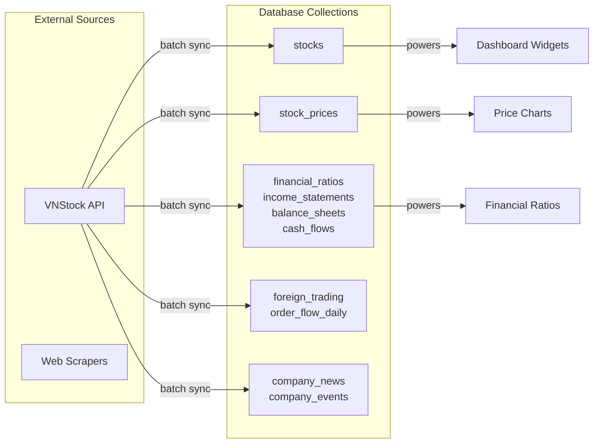

# Database Schema

**Persistence:** self-hosted database stack (private network access)
**Total Collections:** 28 (PostgreSQL/app model) + Mongo `vnibb-market` market corpus
**Active Alembic revision:** `9b0f2c6d4e71` (2026-07-01 — adds `prediction_markets` + unique constraints)

> Two physical stores are described here:
> 1. The **PostgreSQL app model (n6v)** — the 27 collections below that power the
>    application (dashboards, screener, app-facing financials, prediction markets, etc.).
> 2. The **MongoDB `vnibb-market` market corpus** on n6v — the canonical
>    analytical/market datastore that runtime market reads (`/equity/historical`,
>    quant, MCP) prefer. See the dedicated section
>    "MongoDB Market Corpus (n6v)" near the end of this document and
>    `VIETCAP_DATA_SOURCE.md` for the Vietcap-sourced collections.

---

## Capacity And Limits

VNIBB persistence runs on a self-hosted database stack. Capacity is governed by the host's provisioned resources rather than a managed-plan quota.

| Resource | Guidance | Notes |
|----------|----------|-------|
| **Bandwidth** | Bounded by host network | Outbound data transfer |
| **Storage** | Bounded by host disk | Total document storage |
| **Throughput** | Bounded by host CPU/IO | Read/write operations |
| **Users** | Bounded by host resources | Authenticated users |

### Operational Considerations

- **Bandwidth budget**: At ~26 collections with ~5-10 attributes each, document reads are lean. Heavy bandwidth consumers are `stock_prices` (historical OHLCV) and `screener_snapshots` (pre-calculated metrics).
- **Storage headroom**: provision disk to accommodate ~2-3 years of daily stock prices for ~1700 symbols plus financial statements, news, and market data.
- **Throughput budget**: backend uses batching and caching to keep operation volume well within host capacity.
- **User ceiling**: scales with host resources; user dashboards and auth sessions are the primary auth consumers.

If capacity is approached:
1. Enable stricter cache TTLs for read-heavy endpoints
2. Reduce `stock_prices` history depth for older data
3. Archive `screener_snapshots` to cold storage quarterly
4. Provision additional host resources for higher scale

---

## Entity Relationship Diagram (Mermaid)

```mermaid
erDiagram
    stocks ||--o{ stock_prices : "symbol"
    stocks ||--o{ intraday_trades : "symbol"
    stocks ||--o{ balance_sheets : "symbol"
    stocks ||--o{ cash_flows : "symbol"
    stocks ||--o{ financial_ratios : "symbol"
    stocks ||--o{ income_statements : "symbol"
    stocks ||--o{ dividends : "symbol"
    stocks ||--o{ company_events : "symbol"
    stocks ||--o{ company_news : "symbol"
    stocks ||--o{ insider_deals : "symbol"
    stocks ||--o{ foreign_trading : "symbol"
    stocks ||--o{ order_flow_daily : "symbol"
    stocks ||--o{ orderbook_snapshots : "symbol"
    stocks ||--o{ screener_snapshots : "symbol"
    
    companies ||--o{ shareholders : "symbol"
    companies ||--o{ officers : "symbol"
    companies ||--o{ subsidiaries : "symbol"
    
    stock_indices ||--o{ screener_snapshots : "index_code"
    
    user_dashboards ||--o{ dashboard_widgets : "dashboard_id"

    prediction_markets {
        int id PK "Auto-increment"
        string source "polymarket, kalshi..."
        string source_id "Provider contract ID"
        string question "Market question text"
        bool active "Contract still tradeable"
        bool closed "Contract resolved"
        float volume "Total traded volume"
        float liquidity "Current liquidity"
        json outcomes "Outcome labels"
        json outcome_prices "Current outcome prices"
    }

    companies {
        string symbol PK "Stock ticker (VNM, VCI...)"
        string company_name "Full company name"
        string short_name "Short name"
        string exchange "HOSE, HNX, UPCOM"
        string industry "Industry classification"
        string sector "Sector"
    }
    
    stocks {
        string symbol PK "Stock ticker"
        string company_name "Company name"
        string exchange "HOSE, HNX, UPCOM"
        string industry "Industry"
        string sector "Sector"
        bool is_active "Active status"
    }
    
    stock_prices {
        string symbol FK "Stock ticker"
        datetime time "Price timestamp"
        string interval "1D, 1H, 15m..."
        float open "Opening price"
        float high "High price"
        float low "Low price"
        float close "Closing price"
        float volume "Trading volume"
    }
    
    income_statements {
        string symbol FK "Stock ticker"
        string period "2024Q1, FY2024..."
        string period_type "QUARTER, YEAR"
        float revenue "Total revenue"
        float gross_profit "Gross profit"
        float net_income "Net income"
        float eps "Earnings per share"
    }
    
    balance_sheets {
        string symbol FK "Stock ticker"
        string period "Period label"
        float total_assets "Total assets"
        float total_liabilities "Total liabilities"
        float total_equity "Total equity"
    }
    
    financial_ratios {
        string symbol FK "Stock ticker"
        string period "Period label"
        float pe_ratio "P/E ratio"
        float pb_ratio "P/B ratio"
        float roe "Return on equity"
        float roa "Return on assets"
    }
    
    foreign_trading {
        string symbol FK "Stock ticker"
        datetime trade_date "Trade date"
        float buy_value "Buy value"
        float sell_value "Sell value"
        float net_value "Net value"
    }
```



---

## Collections Detail

### 1. Stocks (`stocks`)
Master stock list with basic info.

| Attribute | Type | Description |
|----------|------|-------------|
| `symbol` | string | Stock ticker (VNM, VCI, ...) |
| `isin` | string | ISIN code |
| `company_name` | string | Full company name |
| `short_name` | string | Short name |
| `exchange` | string | HOSE, HNX, UPCOM |
| `industry` | string | Industry |
| `sector` | string | Sector |
| `is_active` | bool | Active status |
| `listing_date` | datetime | Listing date |
| `symbol_q` | string | Query attribute (uppercase) |
| `exchange_q` | string | Exchange query |
| `industry_q` | string | Industry query |
| `sector_q` | string | Sector query |

**Indexes:** symbol_q, exchange_q, industry_q

---

### 2. Stock Prices (`stock_prices`)
Historical OHLCV price data.

| Attribute | Type | Description |
|----------|------|-------------|
| `symbol` | string | Stock ticker |
| `time` | datetime | Price timestamp |
| `open` | float | Opening price |
| `high` | float | High price |
| `low` | float | Low price |
| `close` | float | Closing price |
| `volume` | float | Volume |
| `value` | float | Trade value |
| `adj_close` | float | Adjusted close |
| `interval` | string | 1D, 1H, 15m... |
| `symbol_q` | string | Query attribute |
| `time_dt` | datetime | Datetime for queries |
| `interval_q` | string | Interval query |

**Indexes:** symbol_q, time_dt, symbol_q+time_dt+interval_q

---

### 3. Intraday Trades (`intraday_trades`)
Tick-level trade data.

| Attribute | Type | Description |
|----------|------|-------------|
| `symbol` | string | Stock ticker |
| `trade_time` | datetime | Trade timestamp |
| `price` | float | Trade price |
| `volume` | float | Trade volume |
| `match_type` | string | Match type |
| `accumulated_vol` | float | Accumulated volume |
| `accumulated_val` | float | Accumulated value |
| `transaction_id` | string | Transaction ID |

**Indexes:** symbol_q, trade_time_dt, symbol_q+trade_time_dt

---

### 4. Income Statements (`income_statements`)
Income statement data (quarterly/annual).

| Attribute | Type | Description |
|----------|------|-------------|
| `symbol` | string | Stock ticker |
| `period` | string | 2024Q1, FY2024 |
| `period_type` | string | QUARTER, YEAR |
| `fiscal_year` | int | Fiscal year |
| `fiscal_quarter` | int | Fiscal quarter (1-4) |
| `revenue` | float | Total revenue |
| `cost_of_revenue` | float | Cost of revenue |
| `gross_profit` | float | Gross profit |
| `operating_expenses` | float | Operating expenses |
| `operating_income` | float | Operating income |
| `net_income` | float | Net income |
| `eps` | float | Earnings per share |
| `ebitda` | float | EBITDA |

**Indexes:** symbol_q, symbol_q+period_type+fiscal_year+fiscal_quarter

---

### 5. Balance Sheets (`balance_sheets`)
Balance sheet data.

| Attribute | Type | Description |
|----------|------|-------------|
| `symbol` | string | Stock ticker |
| `period` | string | Period label |
| `period_type` | string | QUARTER, YEAR |
| `total_assets` | float | Total assets |
| `current_assets` | float | Current assets |
| `cash_and_equivalents` | float | Cash |
| `total_liabilities` | float | Total liabilities |
| `current_liabilities` | float | Current liabilities |
| `total_equity` | float | Total equity |
| `book_value_per_share` | float | BVPS |

**Indexes:** symbol_q, symbol_q+period_type+fiscal_year+fiscal_quarter

---

### 6. Cash Flows (`cash_flows`)
Cash flow statement data.

| Attribute | Type | Description |
|----------|------|-------------|
| `symbol` | string | Stock ticker |
| `period` | string | Period label |
| `operating_cash_flow` | float | Operating cash flow |
| `free_cash_flow` | float | Free cash flow |
| `dividends_paid` | float | Dividends paid |
| `net_change_in_cash` | float | Net change in cash |

**Indexes:** symbol_q, symbol_q+period_type+fiscal_year+fiscal_quarter

---

### 7. Financial Ratios (`financial_ratios`)
Pre-calculated financial ratios.

| Attribute | Type | Description |
|----------|------|-------------|
| `symbol` | string | Stock ticker |
| `period` | string | Period label |
| `pe_ratio` | float | P/E ratio |
| `pb_ratio` | float | P/B ratio |
| `ps_ratio` | float | P/S ratio |
| `peg_ratio` | float | PEG ratio |
| `ev_ebitda` | float | EV/EBITDA |
| `ev_sales` | float | EV/Sales |
| `roe` | float | Return on equity |
| `roa` | float | Return on assets |
| `roic` | float | Return on invested capital |
| `gross_margin` | float | Gross margin |
| `net_margin` | float | Net margin |
| `current_ratio` | float | Current ratio |
| `quick_ratio` | float | Quick ratio |
| `debt_to_equity` | float | Debt/Equity |
| `eps` | float | Earnings per share |
| `dps` | float | Dividend per share |

**Indexes:** symbol_q, symbol_q+period_type+fiscal_year+fiscal_quarter

---

### 8. Companies (`companies`)
Extended company information.

| Attribute | Type | Description |
|----------|------|-------------|
| `symbol` | string | Stock ticker |
| `company_name` | string | Full company name |
| `short_name` | string | Short name |
| `english_name` | string | English name |
| `exchange` | string | Exchange |
| `industry` | string | Industry |
| `sector` | string | Sector |
| `subsector` | string | Sub-sector |
| `outstanding_shares` | float | Outstanding shares |
| `listed_shares` | float | Listed shares |
| `website` | string | Website |
| `address` | string | Address |

**Indexes:** symbol_q, exchange_q, industry_q

---

### 9. Shareholders (`shareholders`)
Major shareholders data.

| Attribute | Type | Description |
|----------|------|-------------|
| `company_id` | string | Company ID |
| `symbol` | string | Stock ticker |
| `name` | string | Shareholder name |
| `shareholder_type` | string | Type (individual, institution...) |
| `shares_held` | float | Shares held |
| `ownership_pct` | float | Ownership percentage |
| `as_of_date` | datetime | Snapshot date |

**Indexes:** symbol_q, symbol_q+as_of_date_dt

---

### 10. Officers (`officers`)
Company officers/executives.

| Attribute | Type | Description |
|----------|------|-------------|
| `company_id` | string | Company ID |
| `symbol` | string | Stock ticker |
| `name` | string | Officer name |
| `title` | string | Title |
| `position_type` | string | Position type |
| `shares_held` | float | Shares held |
| `ownership_pct` | float | Ownership percentage |

**Indexes:** symbol_q

---

### 11. Subsidiaries (`subsidiaries`)
Company subsidiaries.

| Attribute | Type | Description |
|----------|------|-------------|
| `symbol` | string | Stock ticker |
| `subsidiary_name` | string | Subsidiary name |
| `subsidiary_symbol` | string | Subsidiary ticker |
| `ownership_pct` | float | Ownership percentage |
| `relationship_type` | string | Subsidiary, Associate... |

**Indexes:** symbol_q

---

### 12. Dividends (`dividends`)
Dividend history.

| Attribute | Type | Description |
|----------|------|-------------|
| `symbol` | string | Stock ticker |
| `exercise_date` | datetime | Exercise date |
| `cash_year` | int | Cash year |
| `dividend_rate` | float | Dividend rate |
| `dividend_value` | float | Dividend value |
| `issue_method` | string | Cash, Stock... |
| `record_date` | datetime | Record date |
| `payment_date` | datetime | Payment date |

**Indexes:** symbol_q, symbol_q+exercise_date_dt

---

### 13. Company Events (`company_events`)
Corporate events (AGM, dividends, splits...).

| Attribute | Type | Description |
|----------|------|-------------|
| `symbol` | string | Stock ticker |
| `event_type` | string | AGM, Dividend, Split... |
| `event_date` | datetime | Event date |
| `ex_date` | datetime | Ex-date |
| `record_date` | datetime | Record date |
| `payment_date` | datetime | Payment date |
| `value` | float | Event value |

**Indexes:** symbol_q, symbol_q+event_type_q+event_date_dt

---

### 14. Company News (`company_news`)
Company news articles.

| Attribute | Type | Description |
|----------|------|-------------|
| `symbol` | string | Stock ticker |
| `title` | string | News title |
| `summary` | string | Summary |
| `source` | string | News source |
| `url` | string | Source URL |
| `published_date` | datetime | Published date |
| `rsi` | float | Relative Strength Index |
| `rs` | float | Relative Strength |
| `price` | float | Related price |

**Indexes:** symbol_q, symbol_q+published_date_dt, source_q

---

### 15. Insider Deals (`insider_deals`)
Insider trading transactions.

| Attribute | Type | Description |
|----------|------|-------------|
| `symbol` | string | Stock ticker |
| `announce_date` | datetime | Announcement date |
| `deal_method` | string | Buy, Sell... |
| `deal_action` | string | Transaction type |
| `deal_quantity` | float | Quantity |
| `deal_price` | float | Price |
| `deal_value` | float | Total value |
| `insider_name` | string | Insider name |

**Indexes:** symbol_q, announce_date_dt

---

### 16. Foreign Trading (`foreign_trading`)
Daily foreign trading data.

| Attribute | Type | Description |
|----------|------|-------------|
| `symbol` | string | Stock ticker |
| `trade_date` | datetime | Trade date |
| `buy_volume` | float | Buy volume |
| `buy_value` | float | Buy value |
| `sell_volume` | float | Sell volume |
| `sell_value` | float | Sell value |
| `net_volume` | float | Net volume |
| `net_value` | float | Net value |
| `room_available` | float | Foreign room available |
| `room_pct` | float | Foreign room % |

**Indexes:** symbol_q, symbol_q+trade_date_dt

---

### 17. Order Flow Daily (`order_flow_daily`)
Daily order flow analysis.

| Attribute | Type | Description |
|----------|------|-------------|
| `symbol` | string | Stock ticker |
| `trade_date` | datetime | Trade date |
| `buy_volume` | float | Buy volume |
| `sell_volume` | float | Sell volume |
| `buy_value` | float | Buy value |
| `sell_value` | float | Sell value |
| `net_volume` | float | Net volume |
| `foreign_buy_volume` | float | Foreign buy |
| `foreign_sell_volume` | float | Foreign sell |
| `big_order_count` | int | Big orders count |
| `block_trade_count` | int | Block trades count |

**Indexes:** symbol_q, symbol_q+trade_date_dt

---

### 18. Orderbook Snapshots (`orderbook_snapshots`)
Price depth snapshots.

| Attribute | Type | Description |
|----------|------|-------------|
| `symbol` | string | Stock ticker |
| `snapshot_time` | datetime | Snapshot time |
| `bid1_price` | float | Bid level 1 |
| `bid1_volume` | float | Bid volume 1 |
| `bid2_price` | float | Bid level 2 |
| `bid2_volume` | float | Bid volume 2 |
| `bid3_price` | float | Bid level 3 |
| `bid3_volume` | float | Bid volume 3 |
| `ask1_price` | float | Ask level 1 |
| `ask1_volume` | float | Ask volume 1 |
| `total_bid_volume` | float | Total bid volume |
| `total_ask_volume` | float | Total ask volume |

**Indexes:** symbol_q, snapshot_time_dt, symbol_q+snapshot_time_dt

---

### 19. Derivative Prices (`derivative_prices`)
Futures/derivatives price data.

| Attribute | Type | Description |
|----------|------|-------------|
| `symbol` | string | Derivative symbol |
| `trade_date` | datetime | Trade date |
| `open` | float | Open |
| `high` | float | High |
| `low` | float | Low |
| `close` | float | Close |
| `volume` | float | Volume |
| `open_interest` | float | Open interest |
| `interval` | string | Interval |

**Indexes:** symbol_q, symbol_q+trade_date_dt+interval_q

---

### 20. Stock Indices (`stock_indices`)
Index data (VN30, HNX, VNAll...).

| Attribute | Type | Description |
|----------|------|-------------|
| `index_code` | string | Index code (VN30, HNX...) |
| `time` | datetime | Timestamp |
| `open` | float | Open |
| `high` | float | High |
| `low` | float | Low |
| `close` | float | Close |
| `volume` | float | Volume |
| `value` | float | Value |
| `change` | float | Point change |
| `change_pct` | float | Percent change |

**Indexes:** index_code_q, index_code_q+time_dt

---

### 21. Market Sectors (`market_sectors`)
Sector definitions and hierarchy.

| Attribute | Type | Description |
|----------|------|-------------|
| `sector_code` | string | Sector code |
| `sector_name` | string | Sector name |
| `sector_name_en` | string | English name |
| `parent_code` | string | Parent sector code |
| `level` | int | Hierarchy level |
| `icb_code` | string | ICB classification |

**Indexes:** sector_code_q, parent_code_q

---

### 22. Sector Performance (`sector_performance`)
Daily sector performance.

| Attribute | Type | Description |
|----------|------|-------------|
| `sector_code` | string | Sector code |
| `trade_date` | datetime | Trade date |
| `change_pct` | float | Change % |
| `avg_change_pct` | float | Avg change % |
| `total_value` | float | Total value |

**Indexes:** sector_code_q, sector_code_q+trade_date_dt

---

### 23. Screener Snapshots (`screener_snapshots`)
Daily pre-calculated screener data.

| Attribute | Type | Description |
|----------|------|-------------|
| `symbol` | string | Stock ticker |
| `snapshot_date` | datetime | Snapshot date |
| `company_name` | string | Company name |
| `exchange` | string | Exchange |
| `industry` | string | Industry |
| `price` | float | Price |
| `volume` | float | Volume |
| `market_cap` | float | Market cap |
| `pe` | float | P/E |
| `pb` | float | P/B |
| `ps` | float | P/S |
| `ev_ebitda` | float | EV/EBITDA |
| `roe` | float | ROE |
| `roa` | float | ROA |
| `roic` | float | ROIC |
| `gross_margin` | float | Gross margin |
| `net_margin` | float | Net margin |
| `revenue_growth` | float | Revenue growth |
| `earnings_growth` | float | Earnings growth |
| `dividend_yield` | float | Dividend yield |
| `debt_to_equity` | float | Debt/Equity |
| `current_ratio` | float | Current ratio |
| `foreign_ownership` | float | Foreign ownership % |
| `rs_rating` | float | Relative Strength rating |

**Indexes:** symbol_q, snapshot_date_dt, snapshot_date_dt+industry_q, snapshot_date_dt+market_cap_f

---

### 24. User Dashboards (`user_dashboards`)
User dashboard configurations.

| Attribute | Type | Description |
|----------|------|-------------|
| `user_id` | string | User ID |
| `name` | string | Dashboard name |
| `description` | string | Description |
| `is_default` | bool | Default dashboard |
| `layout_config` | json | Layout configuration |

**Indexes:** None (document-level security)

---

### 25. Dashboard Widgets (`dashboard_widgets`)
Widget configurations per dashboard.

| Attribute | Type | Description |
|----------|------|-------------|
| `dashboard_id` | string | Dashboard ID |
| `widget_id` | string | Widget ID |
| `widget_type` | string | Widget type |
| `layout` | json | Widget layout |
| `widget_config` | json | Widget configuration |

**Indexes:** None

---

### 26. System Dashboard Templates (`system_dashboard_templates`)
System dashboard templates.

| Attribute | Type | Description |
|----------|------|-------------|
| `dashboard_key` | string | Template key |
| `status` | string | Status |
| `version` | string | Version |
| `dashboard_json` | json | Dashboard definition |
| `notes` | string | Notes |

**Indexes:** (not specified)

---

### 27. Prediction Markets (`prediction_markets`)
External prediction-market contracts sourced from Polymarket and similar providers. Populated by the daily sync pipeline; exposed at `/api/v1/prediction-markets`.

| Attribute | Type | Nullable | Default | Description |
|-----------|------|----------|---------|-------------|
| `id` | integer | NO | sequence | Primary key |
| `source` | varchar(32) | NO | — | Provider identifier (`polymarket`, `kalshi`, ...) |
| `source_id` | varchar(128) | NO | — | Provider's contract ID |
| `question` | text | NO | — | Market question text |
| `slug` | varchar(255) | YES | — | URL-friendly identifier |
| `description` | text | YES | — | Extended description |
| `category` | varchar(100) | YES | — | Market category |
| `url` | text | YES | — | Link to contract page |
| `end_date` | timestamptz | YES | — | Contract resolution date |
| `active` | boolean | NO | `true` | Contract still tradeable |
| `closed` | boolean | NO | `false` | Contract resolved/settled |
| `volume` | float | YES | — | Total traded volume (USD) |
| `liquidity` | float | YES | — | Current liquidity (USD) |
| `outcomes` | json | NO | `[]` | Outcome label array |
| `outcome_prices` | json | NO | `[]` | Current outcome price array |
| `created_at` | timestamp | YES | — | Row created at |
| `updated_at` | timestamp | YES | — | Row last updated at |

**Unique constraint:** `uq_prediction_markets_source_id` on `(source, source_id)`

**Indexes:**
- `pk_prediction_markets` — primary key on `id`
- `uq_prediction_markets_source_id` — unique `(source, source_id)`
- `ix_prediction_markets_source_active` — `(source, active)` for active-contract queries
- `ix_prediction_markets_end_date` — `end_date` for expiry-window queries

**Migration:** `9b0f2c6d4e71` — `20260701_0900_add_prediction_markets_and_conflict_constraints.py`

---

### 28. Sync Status (`sync_status`)
Internal scheduler state table tracking data-pipeline job runs (daily trading, foreign trading, news crawls, etc.). Written by `vnibb.core.scheduler` on each job completion or failure.

| Attribute | Type | Nullable | Default | Description |
|-----------|------|----------|---------|-------------|
| `id` | integer | NO | serial | Primary key (sequence) |
| `sync_type` | varchar | NO | — | Job identifier (`daily_trading`, `foreign_trading`, `news_crawl`, etc.) |
| `started_at` | timestamp | NO | — | Job start time |
| `completed_at` | timestamp | YES | — | Job end time (NULL if still running) |
| `success_count` | integer | NO | — | Successful operations count |
| `error_count` | integer | NO | — | Failed operations count |
| `status` | varchar | NO | — | `running`, `completed`, `failed` |
| `errors` | json | YES | — | Error log (array of error messages when `error_count` > 0) |
| `additional_data` | json | YES | — | Job-specific metadata (symbols processed, date ranges, etc.) |

**Primary key:** `sync_status_pkey` on `id`

**Purpose:** Audit log for data-pipeline health monitoring. The latest row per `sync_type` reflects the last sync run status. Prevents duplicate work via sequence-guarded inserts.

**Critical note:** The sequence `sync_status_id_seq` must stay ahead of the committed max ID. Desync causes primary-key collisions that crash jobs. Fixed 2026-07-01 by `setval` alignment and scheduler hardening (`ERROR`-level logging on exceptions).

---

## Relationship Summary

```
stocks (1) ──┬── (*) stock_prices
             ├── (*) intraday_trades
             ├── (*) balance_sheets
             ├── (*) cash_flows
             ├── (*) financial_ratios
             ├── (*) income_statements
             ├── (*) dividends
             ├── (*) company_events
             ├── (*) company_news
             ├── (*) insider_deals
             ├── (*) foreign_trading
             ├── (*) order_flow_daily
             ├── (*) orderbook_snapshots
             └── (*) screener_snapshots

companies (1) ──┬── (*) shareholders
                ├── (*) officers
                └── (*) subsidiaries

user_dashboards (1) ── (*) dashboard_widgets

stock_indices (1) ── (*) screener_snapshots (via index_code)
```

---

## Dimensional Modeling

VNIBB follows a **star schema** design pattern with `stocks` as the central fact hub.

### Dimension Tables (Dims)

Dimension tables provide descriptive context for facts. They are typically:
- Low volume (hundreds to thousands of records)
- Rarely updated (batch sync on schedule)
- Queried for filtering and grouping

| Dim Table | Primary Key | Description | Connects To |
|-----------|-------------|-------------|-------------|
| **`stocks`** | `symbol` | Stock master - ticker, exchange, industry, sector | All stock-level facts |
| **`companies`** | `symbol` | Extended company info - name, shares, registration | Ownership facts |
| **`market_sectors`** | `sector_code` | Sector hierarchy with ICB classification | Sector facts |

### Fact Tables (Facts)

Fact tables contain measurable, transactional data. They are typically:
- High volume (thousands to millions of records)
- Time-series oriented
- Queried aggregations

| Fact Table | Grain | Description |
|-----------|-------|-------------|
| **`stock_prices`** | symbol + time + interval | OHLCV price data |
| **`stock_indices`** | index_code + time | Market index values |
| **`intraday_trades`** | symbol + trade_time | Tick-level trades |
| **`income_statements`** | symbol + period | Quarterly/annual income |
| **`balance_sheets`** | symbol + period | Balance sheet snapshots |
| **`cash_flows`** | symbol + period | Cash flow statements |
| **`financial_ratios`** | symbol + period | Pre-calculated ratios |
| **`foreign_trading`** | symbol + trade_date | Daily foreign activity |
| **`order_flow_daily`** | symbol + trade_date | Daily order flow |
| **`orderbook_snapshots`** | symbol + snapshot_time | Price depth snapshots |
| **`insider_deals`** | id (symbol + date) | Insider transactions |
| **`dividends`** | symbol + exercise_date | Dividend events |
| **`company_events`** | symbol + event_date | Corporate events |
| **`company_news`** | symbol + published_date | News articles |
| **`derivative_prices`** | symbol + trade_date + interval | Futures/derivatives |
| **`screener_snapshots`** | symbol + snapshot_date | Daily pre-calculated metrics |
| **`prediction_markets`** | source + source_id | External prediction-market contracts |

### Bridge Tables

Many-to-many relationships requiring junction tables:

| Bridge Table | Connects | Purpose |
|--------------|----------|---------|
| **`shareholders`** | companies → individuals | Major shareholder tracking |
| **`officers`** | companies → individuals | Management/executive tracking |
| **`subsidiaries`** | companies → companies | Subsidiary relationships |

### User Data Tables

| Table | Type | Description |
|-------|------|-------------|
| **`user_dashboards`** | Dim | User personalization |
| **`dashboard_widgets`** | Fact | Widget configuration per dashboard |
| **`system_dashboard_templates`** | Dim | Pre-built template definitions |

### Star Schema Diagram

```
                    ┌─────────────────┐
                    │   dim_stocks    │
                    │   (symbol PK)   │
                    │  exchange       │
                    │  industry       │
                    │  sector         │
                    └────────┬────────┘
                             │
        ┌────────────────────┼────────────────────┐
        │                    │                    │
        ▼                    ▼                    ▼
┌───────────────┐  ┌─────────────────┐  ┌─────────────────┐
│ fact_prices   │  │ fact_financials │  │ fact_trading    │
│ symbol+time   │  │ symbol+period   │  │ symbol+date     │
└───────────────┘  └─────────────────┘  └─────────────────┘
                            │
        ┌───────────────────┼───────────────────┐
        ▼                   ▼                   ▼
┌───────────────┐  ┌─────────────────┐  ┌─────────────────┐
│ income_stmt   │  │ balance_sheet   │  │ cash_flows      │
└───────────────┘  └─────────────────┘  └─────────────────┘
        │
        ▼
┌───────────────┐
│ fact_ratios   │
│ symbol+period │
└───────────────┘
```

### Slowly Changing Dimensions (SCD)

| Dim Table | SCD Type | Strategy |
|-----------|----------|----------|
| `stocks` | Type 1 | Overwrite on change (exchange, industry drift) |
| `companies` | Type 1 | Overwrite on change |
| `market_sectors` | Type 0 | Immutable hierarchy (new codes only) |
| `shareholders` | Type 2 | Track historical ownership with `as_of_date` |
| `officers` | Type 1 | Overwrite on title/position change |

### Query Patterns

**Dimension-first queries** (filter then fact):
```
1. SELECT symbol FROM stocks WHERE industry = 'Banking'
2. SELECT * FROM financial_ratios WHERE symbol IN (...) AND period = 'FY2024'
```

**Fact-first queries** (aggregate then dim join):
```
1. SELECT symbol, SUM(buy_value) FROM foreign_trading GROUP BY symbol
2. SELECT s.industry, AVG(f.roe) FROM stocks s JOIN financial_ratios f ON s.symbol = f.symbol GROUP BY s.industry
```

**Conformed Dimensions**

`stocks.symbol` and `companies.symbol` are conformed dimensions reused across all facts, enabling cross-domain analysis (e.g., joining foreign_trading with financial_ratios on symbol).

---

## MongoDB Market Corpus (n6v)

Physical store: MongoDB database `vnibb-market` on n6v (`100.72.199.91:27017`).
This is the canonical analytical/market corpus, separate from the Appwrite app
model above. Runtime market reads (`/equity/historical`, quant endpoints, MCP
`get_eod_price_history`) prefer this store.

### Provenance / `source` convention

Market rows carry a `source` field. Precedence is **`vietcap` > `vnstock-data`**.

- `vietcap` — public Vietcap endpoints (primary). Prices are **raw VND**
  (`priceUnit: "VND"`). Deeper history (back to listing date, often pre-2015).
- `vnstock-data` — vnstock provider (fallback). Prices are **thousand VND**
  (multiply by 1000 for parity with Vietcap).

The EOD read path filters only on `(symbol, tradeDate)` and ignores `source`,
so exactly one bar per trading day must exist. The Vietcap backfill enforces this
by deleting overlapping `vnstock-data` bars whenever a `vietcap` bar exists for
the same `(symbol, tradeDate)` (the `--reconcile` step). See
`VIETCAP_DATA_SOURCE.md`.

### `market_prices_eod`
Canonical daily OHLCV for stocks, ETFs, and indices.

| Attribute | Type | Description |
|---|---|---|
| `symbol` | string | Ticker / index symbol |
| `tradeDate` | datetime | Trading day, normalized to `07:00:00` |
| `interval` | string | `1D` |
| `source` | string | `vietcap` (primary) or `vnstock-data` (fallback) |
| `sourceKey` | string | `{source}:{SYMBOL}:eod:{YYYY-MM-DD}` |
| `open`/`high`/`low`/`close` | float | OHLC (raw VND for `vietcap`) |
| `volume` | int | Volume |
| `value` | float | Trade value (when available) |
| `accumulatedVolume`/`accumulatedValue` | float | Session accumulators (vietcap) |
| `priceUnit` | string | `VND` for vietcap rows |
| `createdAt`/`updatedAt`/`syncedAt` | datetime | Provenance timestamps |
| `schemaVersion` | int | `1` |

**Indexes:** `idx_symbol_tradeDate_desc` (existing), `(symbol, tradeDate, source)`

### `market_prices_cw` / `market_prices_derivatives` / `market_prices_bond`
Same OHLCV shape as `market_prices_eod`, kept separate so the stock corpus stays
clean. `cw` = covered warrants, `derivatives` = futures (`FU`), `bond` =
bonds/debentures.

**Indexes:** `(symbol, tradeDate, source)` unique

### `market_vnstock_premium_records`
Multi-dataset raw record store for fundamentals and company data.

| Attribute | Type | Description |
|---|---|---|
| `dataset` | string | e.g. `finance.income_statement`, `finance.balance_sheet`, `finance.cash_flow`, `finance.ratio`, `company.shareholder_structure` |
| `datasetGroup` | string | `finance`, `company`, ... |
| `section` | string | Statement section (financial statements) |
| `symbol` | string | Ticker |
| `source` | string | `vietcap` or `vnstock-data` |
| `recordKey` | string | Stable per-period identity |
| `period` | string | `FY2025`, `2025-Q1` |
| `periodType` | string | `YEAR`, `QUARTER` |
| `fiscalYear`/`fiscalQuarter` | int | Period decomposition |
| `observedAt` | datetime | Period anchor |
| `raw` | object | Raw provider document (coded fields like `isa20`, `bsa53`) |
| `schemaVersion` | int | `1` |

**Indexes:** `(dataset, symbol, recordKey)` unique

### `market_financial_metric_map`
Code->label dictionary for decoding `raw` financial fields.

| Attribute | Type | Description |
|---|---|---|
| `comTypeCode` | string | Company type (e.g. `IN`, `CT`, bank/securities/insurance) |
| `section` | string | `INCOME_STATEMENT`, `BALANCE_SHEET`, `CASH_FLOW`, `NOTE` |
| `source` | string | `vietcap` |
| `labels` | object | `{ field: {field, name, level, parent, titleEn, titleVi, ...} }` |
| `fieldCount` | int | Number of mapped fields |

**Indexes:** `(comTypeCode, section, source)` unique

### `market_company_profiles`
Company master + analyst coverage (Vietcap `details` + `search-bar`).

| Attribute | Type | Description |
|---|---|---|
| `symbol` | string | Ticker |
| `source` | string | `vietcap` |
| `details` | object | `currentPrice`, `marketCap`, `rating`, `targetPrice`, `sector`, `icbCodeLv2/4`, ownership %, `freeFloat`, profile HTML... |
| `searchBar` | object | ICB hierarchy `icbLv1..4`, `inCu`, rating, target price |

**Indexes:** `(symbol, source)` unique

### `market_index_constituents`
Index/group membership from `getByGroup`.

| Attribute | Type | Description |
|---|---|---|
| `group` | string | `VN30`, `VN100`, `HOSE`, `HNX30`, `ETF`, `CW`, `BOND`, `FU_INDEX`... |
| `source` | string | `vietcap` |
| `members` | string[] | Member symbols |
| `memberCount` | int | Count |

**Indexes:** `(group, source)` unique

### `market_icb_sectors`
ICB sector dictionary from `sectors/icb-codes`.

| Attribute | Type | Description |
|---|---|---|
| `icbCode` | string | ICB code (`name` in source) |
| `source` | string | `vietcap` |
| `enSector`/`viSector` | string | Sector labels |
| `icbLevel` | int | Hierarchy level (1-4) |
| `marketCap` | float | Aggregate market cap (when present) |

**Indexes:** `(icbCode, source)` unique

### Future Appwrite mirror mapping

When a controlled Appwrite mirror is re-enabled, project the Mongo corpus into
the app model as follows:

| Mongo (vnibb-market) | Appwrite/app collection |
|---|---|
| `market_prices_eod` | `stock_prices` |
| `market_prices_derivatives` | `derivative_prices` |
| `market_vnstock_premium_records` (`finance.income_statement`) | `income_statements` |
| `market_vnstock_premium_records` (`finance.balance_sheet`) | `balance_sheets` |
| `market_vnstock_premium_records` (`finance.cash_flow`) | `cash_flows` |
| `market_vnstock_premium_records` (`finance.ratio`) | `financial_ratios` |
| `market_vnstock_premium_records` (`company.shareholder_structure`) | `shareholders` |
| `market_company_profiles` | `companies` / `stocks` |
| `market_index_constituents` | `stock_indices` constituents |
| `market_icb_sectors` | `market_sectors` |

Field-level decode for financial statements requires joining
`market_financial_metric_map` to translate coded fields (`isa20`, `bsa53`...)
into the named columns the app collections expect.

---

## Data Flow




---

## Alembic Migration History

| Revision | File | Applied | Description |
|----------|------|---------|-------------|
| `7f3a8d1e6b22` | (initial schema) | pre-2026-07-01 | Baseline — all 26 original tables |
| `9b0f2c6d4e71` | `20260701_0900_add_prediction_markets_and_conflict_constraints.py` | 2026-07-01 | Adds `prediction_markets` table + unique constraints on `foreign_trading`, `market_news`, `stock_prices` |

**Running migrations on production:**

```bash
# On OCI host — runs inside vnibb-api container which holds DB credentials
ssh -i ~/.ssh/oci-vnibb ubuntu@129.150.58.64 \
  "docker exec vnibb-api alembic -c /app/alembic.ini upgrade head"
```

To verify after running:

```bash
ssh -i ~/.ssh/oci-vnibb ubuntu@129.150.58.64 \
  "docker exec vnibb-api alembic -c /app/alembic.ini current"
```

**Note:** The API container runs `alembic upgrade head` automatically on startup (via the entrypoint). Manual execution is only needed if you need to migrate without restarting the API.
