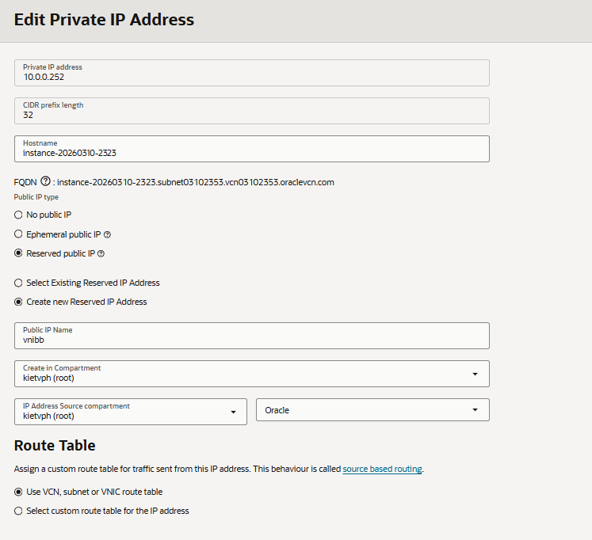

# Oracle Runbook

## 1. Provision Oracle VM

### Recommended shape

- Preferred: Oracle Always Free Ampere A1 VM
- Fallback: an Always Free x86 VM if Ampere capacity is unavailable

### Recommended OS

- Ubuntu 24.04 LTS

### Boot volume guidance

- Keep the boot volume lean and avoid extra paid block volumes unless necessary.
- Use Docker volumes for runtime state that must survive container recreation.

### Public IP guidance

- Attach a reserved public IP so DNS cutover does not depend on a transient address.

### SSH restriction

- Restrict port `22` to operator IP ranges only.

### Base package install

```bash
sudo apt-get update
sudo apt-get upgrade -y
sudo apt-get install -y ca-certificates curl gnupg ufw git jq
```

### Docker install

```bash
curl -fsSL https://get.docker.com | sudo sh
sudo usermod -aG docker "$USER"C.
newgrp docker
docker version
docker compose version
```

## 2. Configure Network

- Allow inbound `80/tcp` from `0.0.0.0/0`
- Allow inbound `443/tcp` from `0.0.0.0/0`
- Restrict inbound `22/tcp` to operator IPs
- Do not expose `8000/tcp` publicly
- Create DNS records for:
  - stable hostname: `api.example.com`
  - canary hostname: `oracle-api.example.com`

## 3. Deploy Runtime

### Prepare deployment files

```bash
cp deployment/env.oracle.example deployment/env.oracle
```

Edit `deployment/env.oracle` and set:

- `SITE_HOSTNAME`
- `ACME_EMAIL`
- `DATABASE_URL`
- `DATABASE_URL_SYNC`
- `APPWRITE_ENDPOINT`
- `APPWRITE_PROJECT_ID`
- `APPWRITE_API_KEY`
- `APPWRITE_DATABASE_ID`
- `REDIS_URL` if Redis remains enabled
- `SENTRY_DSN`
- `ADMIN_API_KEY`
- `LOG_FORMAT=json`
- `CORS_ORIGINS`

### Start the stack

```bash
docker compose -f docker-compose.oracle.yml up -d --build
```

### Verify container health

```bash
docker compose -f docker-compose.oracle.yml ps
docker compose -f docker-compose.oracle.yml logs api --tail=200
docker compose -f docker-compose.oracle.yml logs caddy --tail=200
```

### Verify TLS

- Wait for Caddy to obtain certificates.
- Confirm the canary hostname answers on `https://`.

## 4. Verify Service

### Health checks

```bash
bash scripts/oracle/healthcheck.sh
bash scripts/oracle/smoke_test.sh
BASE_URL=https://oracle-api.example.com bash scripts/oracle/healthcheck.sh
CORS_TEST_ORIGIN=https://vnibb.vercel.app BASE_URL=https://oracle-api.example.com bash scripts/oracle/smoke_test.sh
```

Notes:

- The scripts default to `http://127.0.0.1:8000`, which is useful for local VM rehearsal before DNS is live.
- Override `CORS_TEST_ORIGIN` when validating a non-default frontend origin.

### Log review

```bash
docker compose -f docker-compose.oracle.yml logs api --tail=200
docker compose -f docker-compose.oracle.yml logs caddy --tail=200
```

### What to confirm

- `/live`, `/ready`, `/health/`, and `/api/v1/health` return `200`
- Appwrite is reported as connected
- CORS preflight succeeds for `https://vnibb-web.vercel.app`
- Key API endpoints succeed
- Websocket probe succeeds or is explicitly skipped with a known reason

## 5. Cutover Procedure

1. Freeze backend changes.
2. Re-run Oracle health and smoke checks.
3. Re-run health checks against any rollback target that is still being kept warm.
4. Confirm the stable hostname TTL is already `60`.
5. Switch the stable hostname from the previous backend or OCI canary hostname to the Oracle reserved IP.
6. Wait for DNS propagation.
7. Test the production Vercel frontend against the stable hostname.
8. Monitor minute 0-15:
   - uptime
   - 5xx rate
   - p95 latency
   - websocket reconnects
   - Appwrite connectivity
9. Declare success only after the 15-minute window stays green.

### Required confirmation roles

- Operator confirms deployment health
- Application owner confirms Vercel frontend behavior
- Incident owner confirms metrics/logs are acceptable

## 6. Incident Procedure

### First checks

```bash
docker compose -f docker-compose.oracle.yml ps
docker compose -f docker-compose.oracle.yml logs api --tail=200
docker compose -f docker-compose.oracle.yml logs caddy --tail=200
BASE_URL=https://api.example.com bash scripts/oracle/healthcheck.sh
```

### Safe restarts

```bash
docker compose -f docker-compose.oracle.yml restart api
docker compose -f docker-compose.oracle.yml restart caddy
```

### When to rollback

- `/ready` or `/api/v1/health` is non-200 after restart attempts
- sustained 5xx errors
- broken Appwrite auth/session behavior
- websocket instability severe enough to degrade user experience
- latency regression that breaches the agreed threshold

See [oracle_rollback_plan.md](./oracle_rollback_plan.md) for the exact rollback sequence.

## 7. Maintenance

### Patch cadence

- Apply OS security updates weekly
- Rebuild containers for dependency updates on a planned maintenance window

### Log rotation

- Monitor Docker log growth
- Rotate or cap logs before disk pressure becomes an incident

### Disk checks

```bash
df -h
docker system df
```

### Certificate validation

- Confirm Caddy certificate renewals continue automatically
- Review Caddy logs after renewals or DNS changes

### Oracle quota checks

- Review the current Always Free allowance before resizing or adding volumes
- Reference:
  - [Oracle Cloud Free Tier](https://www.oracle.com/cloud/free/)
  - [Oracle Compute shapes documentation](https://docs.oracle.com/iaas/Content/Compute/References/computeshapes.htm)

### Cost overrun quick check (Always Free)

Use this checklist before and after each deployment to confirm OCI usage remains in Always Free.

Official Always Free thresholds (home region):
- Compute (A1 Flex): up to 4 OCPUs and 24 GB RAM equivalent usage
- Block + boot volumes combined: up to 200 GB
- Outbound data transfer: up to 10 TB/month

Console path for all checks:
- `Governance & Administration -> Limits, Quotas and Usage`

What to verify:
1. Compute usage is below A1 Always Free limits (OCPU + memory)
2. No accidental paid shapes are running (non-Always-Free compute)
3. Boot + block volumes combined remain <= 200 GB
4. Monthly outbound data transfer remains <= 10 TB
5. Resources are provisioned in the tenancy home region when required by Always Free

Recommended VNIBB guardrails:
- Keep one primary `VM.Standard.A1.Flex` backend host
- Keep default/lean boot volumes and avoid extra block volumes
- Use one reserved public IP for stable DNS cutover
- Treat additional compute nodes, larger volumes, and managed OCI add-ons as potential paid expansion

Pass/fail rule:
- PASS: all five checks are within thresholds
- FAIL: any single threshold is exceeded or paid shape usage appears
